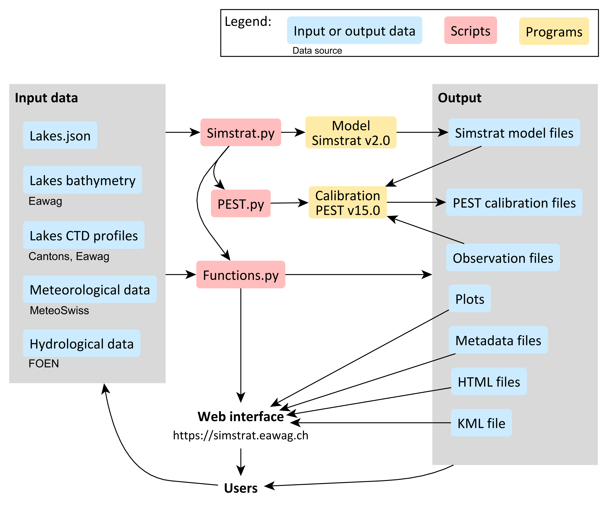

Automated workflow for modelling of Swiss lakes with [Simstrat](https://github.com/Eawag-AppliedSystemAnalysis/Simstrat)

Access the output at: https://simstrat.eawag.ch

The workflow allows to (i) retrieve the newest forcing data directly from data providers and integrate them into the existing datasets, (ii) process the input data and prepare the full model and calibration setups, (iii) run calibration of the model for chosen model parameters, (iv) provide output results, and (v) update an online platform to display these results. The script is controlled by an input file written in JSON format, which specifies the lakes to be modeled together with their physical properties (depth, volume, bathymetry, etc.) and identifies the meteorological and hydrological stations to be used for model forcing. 

The workflow is described in the following article: [article-ref].

